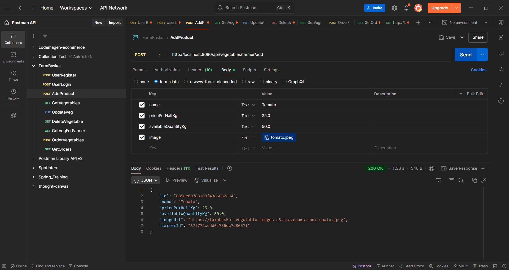
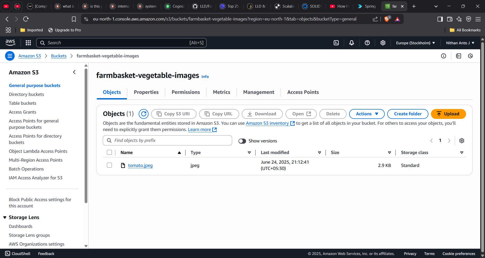
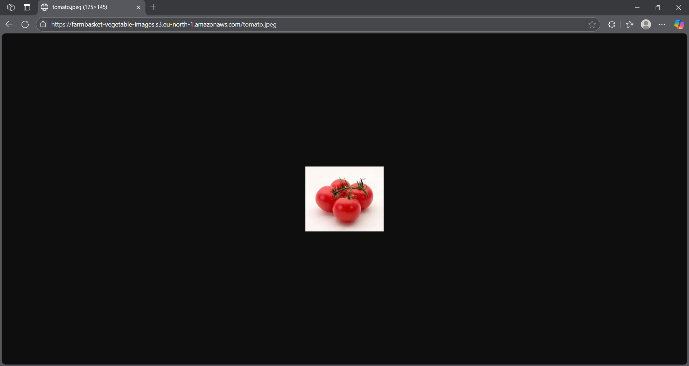
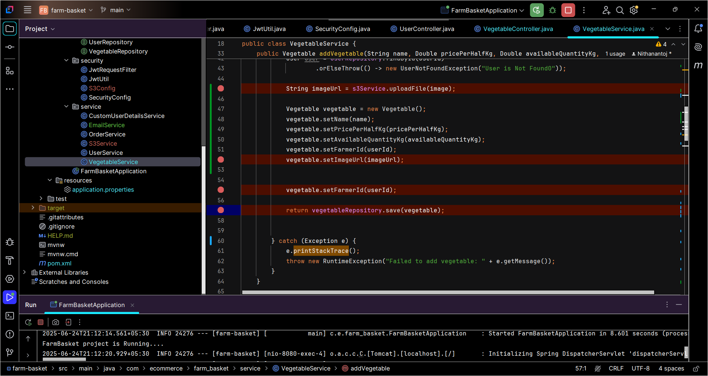

## 🧾 AWS S3 Image Upload Integration

### ✅ 1. Postman Upload Check
Successfully tested image upload with Postman.

---

### 🖼️ 2. AWS S3 Console View
Image successfully uploaded and visible in the AWS S3 bucket.

---

### 🔗 3. Public Image URL Check
Image accessible using the public S3 URL.

---

### 💻 4. Java Code Snippet
The image upload logic using Spring Boot and AWS SDK.

