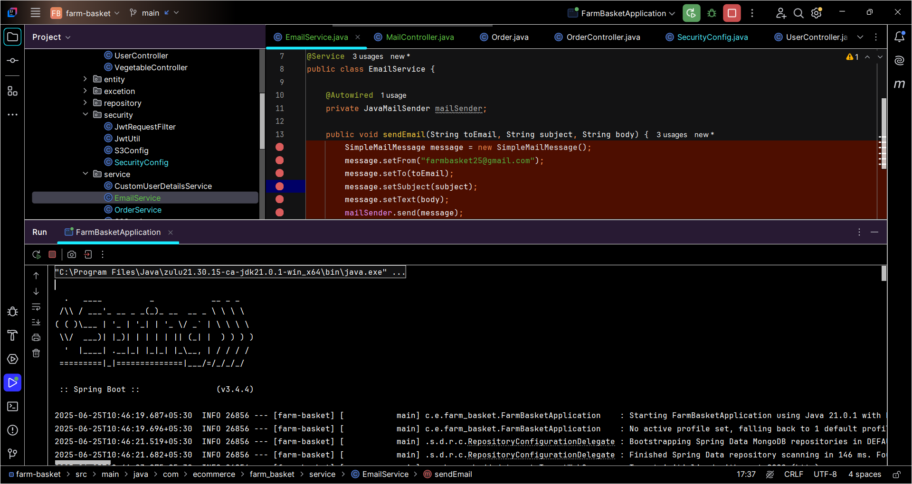
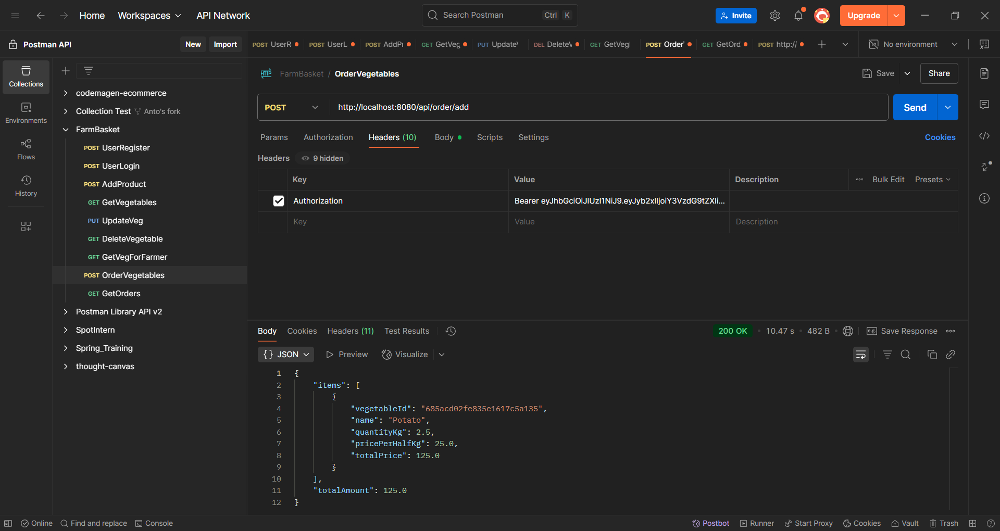
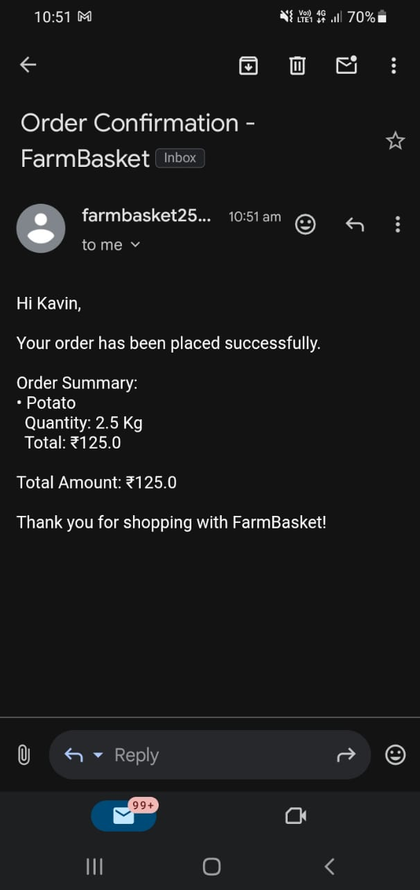
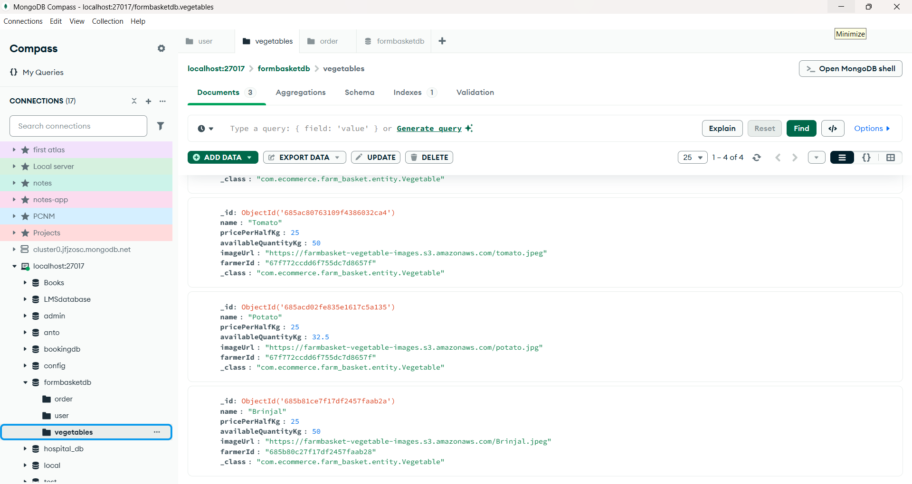

# 🥕 FarmBasket Backend - Spring Boot Application

This backend application powers the **FarmBasket** system, enabling customers to place orders for fresh vegetables directly from farmers. It includes **AWS S3** integration for image uploads and **SMTP email notifications** during order placement.

---

## 🌐 Key Features

- ✅ REST APIs for user registration, login, vegetable listing, and order management
- ☁️ AWS S3 integration for uploading vegetable images
- 📧 SMTP integration for sending emails to customers and farmers upon order placement
- 🛡️ JWT-based Authentication and Role Authorization
- 💾 Local MongoDB Database Integration

---

## 🧾 AWS S3 Image Upload Integration

### ✅ 1. Postman Upload Check
Successfully tested image upload using Postman.

---

### 🖼️ 2. AWS S3 Console View
Image uploaded and visible in the AWS S3 bucket.

---

### 🔗 3. Public Image URL Check
Uploaded image is accessible via S3 public URL.

---

### 💻 4. Java Code Snippet - S3 Upload
Java code for uploading images using the AWS SDK.

---

## 📧 SMTP Email Notification Integration

### 🧠 Implementation Code
Spring Boot code to send emails on order confirmation (to customer) and order alert (to farmer).

---

### 📮 Postman Email Trigger
Triggered email successfully through order placement API in Postman.

---

### 📥 Customer Email Confirmation
Customer receives order confirmation email with item details and amount.

---

## 🗃️ Local MongoDB Integration

- MongoDB is used as the primary database to store:
    - Users
    - Vegetables
    - Orders

---

## 🔐 Security Practices

- All secrets (SMTP, AWS) are stored in `.env` file
- `.env` is included in `.gitignore` to prevent accidental commits
- GitHub secret scanning helps block pushes with exposed credentials

---

## 🚀 Technologies Used

- Java 21
- Spring Boot
- Spring Security + JWT
- MongoDB (Local)
- AWS S3
- JavaMailSender (SMTP)
- Postman (for API testing)

---

## 🤝 Author

**Nithan Anto J**  
Backend Developer | Java | Spring Boot | MERN Stack | Postman API Student Expert

---

